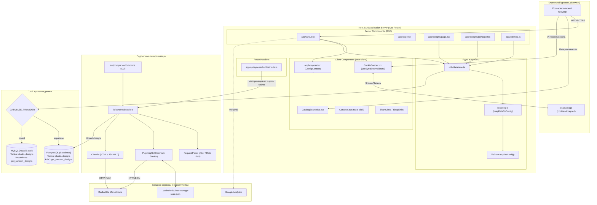
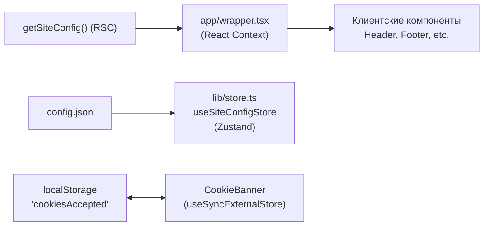

# Архитектура системы Design Studio

## 1. Введение и назначение

**Design Studio** — это веб-платформа и витрина-агрегатор портфолио для print-on-demand (POD) артистов и студий графического дизайна. Система объединяет презентационный каталог дизайнов, оптимизированный под поисковые системы (SEO), ссылки на покупку товаров на внешних маркетплейсах (Redbubble, TeePublic, Tostadora) и подсистему автоматической фоновой синхронизации каталога с аккаунтами на маркетплейсах.

### Ключевые архитектурные цели:
1. **Максимальная производительность и SEO**: Server-Side Rendering (SSR) и генерация метаданных для каждой единицы контента через Next.js App Router.
2. **Гибкость инфраструктуры хранения**: Единый абстрактный слой доступа к данным с поддержкой PostgreSQL (Supabase) и MySQL без изменения бизнес-логики компонентов.
3. **Трехуровневая конфигурация**: Управление параметрами сайта из JSON-файлов по умолчанию, динамических настроек из БД и системных переменных окружения.
4. **Отказоустойчивая синхронизация каталога**: Двухрежимный сбор данных (Playwright + Cheerio) с контролем частоты запросов, обходом антибот-систем и сохранением сессий.

---

## 2. Общая архитектурная диаграмма

На диаграмме ниже представлена сквозная архитектура проекта, взаимодействие компонентов клиента, сервера Next.js, абстракции БД и внешних сервисов:



---

## 3. Иерархия компонентов: Server Components vs Client Components

Проект построен на гибридной модели Next.js 16 (React 19), строго разграничивающей серверную отрисовку (RSC) и клиентскую интерактивность:

### 3.1 Серверные компоненты (React Server Components — RSC)
Выполняются исключительно на сервере. Не включают JavaScript-код в клиентский бандл, имеют прямой доступ к базам данных и генерируют чистый HTML:

| Компонент / Маршрут | Файл | Ответственность |
|---|---|---|
| `RootLayout` | `app/layout.tsx` | Загружает конфигурацию через `getSiteConfig()`, инжектирует теги верификации Pinterest, Google Analytics, стили темы и оборачивает страницу в `ContextWrapper`. |
| `HomePage` | `app/page.tsx` | Формирует главную страницу: Hero-секция, выборка рекомендуемых дизайнов, превью коллекций. |
| `DesignFolio` | `app/designs/page.tsx` | Каталог с пагинацией. Читает `searchParams` (`page`, `search`, `collection`), обращается к `fetchDesigns()` и `fetchCollections()`, генерирует динамические `Metadata`. |
| `DesignDetails` | `app/designs/[id]/page.tsx` | Карточка отдельного дизайна. Загружает запись по UUID через `getDesignById()`, генерирует OpenGraph-теги и подгружает список похожих дизайнов из той же коллекции. |
| `Sitemap` | `app/sitemap.ts` | Динамический генератор `sitemap.xml`. Выгружает до 1000 активных записей через `fetchDesigns()` и формирует актуальные URL для поисковых краулеров. |
| `About`, `Services`, `Contact`, `Policy`, `Terms` | `app/{about,services,...}/page.tsx` | Статические и полустатические информационные страницы со специфическими SEO-метаданными. |

### 3.2 Клиентские компоненты (`"use client"`)
Используются только там, где требуется подписка на браузерные события, доступ к DOM API или локальное состояние:

| Компонент | Файл | Используемые хуки / Причина выноса на клиент |
|---|---|---|
| `ContextWrapper` | `app/wrapper.tsx` | `createContext`, `ConfigContext.Provider`. Пробрасывает серверную конфигурацию `SiteConfig` в дерево клиентских компонентов. |
| `CatalogSearchBar` | `app/components/CatalogSearchBar.tsx` | `useState`, `useRouter`, `useSearchParams`. Управляет полями ввода поисковой строки и выпадающим списком коллекций с переходом по маршруту `/designs?page=1&search=...`. |
| `CookieBanner` | `app/components/CookieBanner.tsx` | `useSyncExternalStore`. Читает и обновляет состояние согласия на куки в `localStorage` без расхождения SSR/гидратации (Hydration Mismatch). |
| `Carousel` | `app/components/Carousel.tsx` | Библиотека `react-slick`. Слайдер с поддержкой тач-событий, адаптивными брейкпоинтами и анимацией. |
| `ContactForm` | `app/components/ContactForm.tsx` | `useState`. Обработка формы обратной связи, валидация полей и отправка сообщений. |
| `Header` / `Footer` | `app/components/{Header,Footer}.tsx` | `useContext(ConfigContext)`. Отображение контактных данных, логотипа, мобильного меню и ссылок. |
| `ShareLinks` | `app/components/ShareLinks.tsx` | Формирование диалоговых окон шаринга в соцсетях (Pinterest, X, Facebook, LinkedIn, WhatsApp). |

---

## 4. Паттерн абстракции базы данных (`utils/database.ts`)

В системе реализован единый фасад доступа к данным, изолирующий приложение от конкретного движка СУБД.

### 4.1 Механизм выбора провайдера
Выбор провайдера осуществляется на этапе инициализации модуля через переменную окружения `DATABASE_PROVIDER`:

```typescript
// utils/database.ts
const provider = process.env.DATABASE_PROVIDER || "supabase";

let supabase: ReturnType<typeof createClient> | null = null;
let pool: mysql.Pool | null = null;

if (provider === "supabase") {
  const supabaseUrl = process.env.NEXT_PUBLIC_SUPABASE_URL;
  const supabaseAnonKey = process.env.NEXT_PUBLIC_SUPABASE_ANON_KEY;
  if (!supabaseUrl || !supabaseAnonKey) {
    throw new Error("Missing Supabase environment variables");
  }
  supabase = createClient(supabaseUrl, supabaseAnonKey);
} else if (provider === "mysql") {
  const { MYSQL_HOST, MYSQL_PORT, MYSQL_USER, MYSQL_PASSWORD, MYSQL_DATABASE } = process.env;
  if (!MYSQL_HOST || !MYSQL_USER || !MYSQL_PASSWORD || !MYSQL_DATABASE) {
    throw new Error("Missing MySQL environment variables");
  }
  pool = mysql.createPool({
    host: MYSQL_HOST,
    port: MYSQL_PORT ? Number(MYSQL_PORT) : 3306,
    user: MYSQL_USER,
    password: MYSQL_PASSWORD,
    database: MYSQL_DATABASE,
  });
} else {
  throw new Error(`Unsupported DATABASE_PROVIDER: ${provider}`);
}
```

### 4.2 Унифицированный контракт функций
Все внешние потребители вызывают методы с идентичными сигнатурами:

1. `getSiteConfig(): Promise<SiteConfig>`
   - **Supabase**: `supabase.from("studio").select("*")`
   - **MySQL**: `pool.query("SELECT * FROM studio")`
   - Результат передается в `mapDataToConfig()` для построения объекта настроек.

2. `fetchDesigns(page, searchQuery, collection, itemsPerPage): Promise<{ designs: Design[]; total: number }>`
   - Выполняет расчет смещения пагинации: `offset = (page - 1) * itemsPerPage`.
   - Накладывает фильтры `ilike` (Supabase) или `LIKE ?` (MySQL) на поле `title`.
   - Фильтрует по полю `collection`.
   - Возвращает нормализованный массив `Design[]` и точное общее количество записей `total`.

3. `getDesignById(id: string): Promise<{ design: Design; relatedDesigns: Design[] } | null>`
   - Находит целевой дизайн по первичному ключу `id`.
   - Выполняет дополнительную выборку до 3 связанных дизайнов из той же коллекции (`collection = target.collection AND id != target.id`).

4. `fetchCollections(): Promise<string[]>`
   - Возвращает массив непустых уникальных названий коллекций для фильтрации в каталоге.

---

## 5. Движок слияния конфигурации (`lib/config.ts`)

Конфигурация сайта использует трехуровневую иерархию переопределения значений:
1. **Дефолтный JSON** (`config/config.json`) — базовые метаданные, заглушки соцсетей, контактные данные.
2. **База данных (таблица `studio`)** — динамические настройки, сохраненные администратором в виде пар `key`/`value`.
3. **Переменные окружения (`.env`)** — секреты, токены доступа и настройки хостинга.

### Алгоритм Dot-Notation в `mapDataToConfig`
В таблице `studio` настройки могут храниться как плоскими ключами (`email`, `phone`), так и составными путями через точку (`social.twitter`, `representation.redbubbleShopUrl`, `analytics.google`). Функция `mapDataToConfig` динамически раскладывает ключи во вложенные объекты:

```typescript
// lib/config.ts
export function mapDataToConfig(props: ConfigProp[]): SiteConfig {
  const config: SiteConfig = baseConfig;
  for (const prop of props) {
    if (/\./.test(prop.key)) {
      const keys = prop.key.split(".");
      const lastKey = keys.pop();
      let obj: SiteConfig = config;
      for (const key of keys) {
        obj = obj[key as keyof typeof obj] as unknown as typeof obj;
      }
      if (lastKey) {
        obj[lastKey as keyof typeof obj] = prop.value as ConfigValue;
      }
      continue;
    }
    config[prop.key as keyof SiteConfig] = prop.value as ConfigValue;
  }
  return config;
}
```

Благодаря этому администратор может точечно переопределить любое вложенное поле объекта `SiteConfig` без необходимости хранить весь JSON целиком в одной строке БД.

---

## 6. Управление состоянием (State Management)

В проекте используется двухуровневая стратегия управления состоянием:



1. **React Context (`ConfigContext` в `app/wrapper.tsx`)**:
   - Основной транспорт для передачи серверной конфигурации клиенту.
   - Серверный компонент `app/layout.tsx` асинхронно получает свежий `SiteConfig` из базы данных при каждом рендере и передает его в `ContextWrapper`.
   - Любой клиентский компонент получает доступ к настройкам через вызов:
     ```typescript
     const config = useContext(ConfigContext);
     ```

2. **Zustand Store (`lib/store.ts`)**:
   - Хранилище `useSiteConfigStore` инициализируется данными из `config/config.json`.
   - Предоставляет метод `updateConfig: (newConfig: Partial<SiteConfig>) => void` для сценариев локальной мутации состояния интерфейса на клиенте без перезагрузки страницы.

3. **Синхронизация с браузерным хранилищем (`useSyncExternalStore`)**:
   - В компоненте `CookieBanner` состояние прочитано не через классический `useEffect` + `useState` (что вызывает мерцание интерфейса при загрузке), а через React 18+ хук `useSyncExternalStore`.
   - Метод `getServerSnapshot` возвращает `true`, что предотвращает отрисовку баннера на этапе SSR, а `getSnapshot` на клиенте проверяет `localStorage.getItem("cookiesAccepted")`. Подписка на событие `window.addEventListener("storage", ...)` обеспечивает мгновенную синхронизацию между открытыми вкладками браузера.
