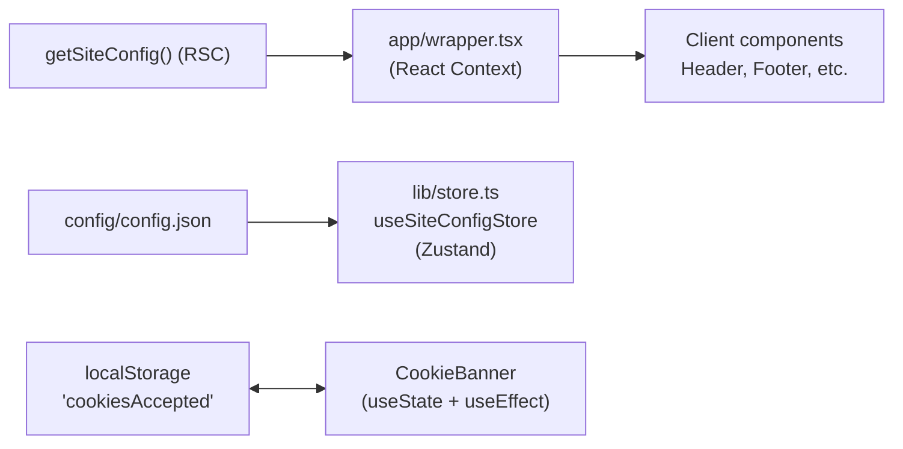

# Design Studio System Architecture

## 1. Introduction and Purpose

**Design Studio** is a web platform and portfolio-aggregator storefront for print-on-demand (POD) artists. The system combines a search-optimized (SEO) presentation catalog of designs, links that funnel buyers to external marketplaces (Redbubble, TeePublic, Tostadora) to purchase, and a background subsystem that keeps the catalog automatically synchronized with the artist's marketplace shop.

Product context in one paragraph: Design Studio is a self-hostable, white-label storefront — buyers are the primary visitors; they browse, search, and click through to a marketplace to purchase, while the operator (the artist) only publishes on the marketplace and lets sync maintain the site. There is no on-site checkout, no admin UI, and every brand touchpoint is runtime configuration. Full product truth, including capabilities and constraints, lives in [PRODUCT.md](../PRODUCT.md); the design system of record lives in [DESIGN.md](../DESIGN.md).

### Key Architectural Goals

1. **Maximum performance and SEO**: server-side rendering (SSR) and per-content metadata generation via the Next.js App Router, plus dynamic `sitemap.xml`, `robots.txt`, and JSON-LD structured data.
2. **Storage-infrastructure flexibility**: a single abstract data-access layer supporting PostgreSQL (Supabase) and MySQL with no changes to component business logic.
3. **Three-tier configuration and white-label theming**: site parameters resolve from default JSON, dynamic database settings, and environment variables — and the entire visual skin re-skins per deployment through the design-token layer (see section 7).
4. **Resilient catalog synchronization**: two-mode data collection (Playwright + Cheerio) with request pacing, anti-bot-system evasion, and persisted browser sessions.

---

## 2. Overall Architecture Diagram

The diagram below shows the end-to-end architecture: client-side components, the Next.js server, the database abstraction, and external services.

```mermaid
flowchart TB
    subgraph ClientLayer ["Client layer (Browser)"]
        Browser["User browser"]
        CookieStorage["localStorage (cookiesAccepted)"]
    end

    subgraph NextServer ["Next.js 16 Application Server (App Router)"]
        subgraph ServerComponents ["Server Components (RSC)"]
            RootLayout["app/layout.tsx"]
            HomePage["app/page.tsx"]
            CatalogPage["app/designs/page.tsx"]
            DetailPage["app/designs/[id]/page.tsx"]
            Sitemap["app/sitemap.ts"]
            Robots["app/robots.ts"]
        end

        subgraph ClientComponents ["Client Components ('use client')"]
            ContextWrap["app/wrapper.tsx (ConfigContext)"]
            SearchBar["CatalogSearchBar.tsx"]
            CookieBannerComp["CookieBanner.tsx (useState + useEffect)"]
            SliderComp["Carousel.tsx (react-slick)"]
            Social["ShareLinks / ShopLinks"]
        end

        subgraph APIEndpoints ["Route Handlers"]
            SyncRoute["app/api/sync/redbubble/route.ts"]
        end

        subgraph CoreLib ["Core and utilities"]
            ConfigEngine["lib/config.ts (mapDataToConfig)"]
            ZustandStore["lib/store.ts (SiteConfig)"]
            DBAbstraction["utils/database.ts"]
            UiPrimitives["components/ui/ (Button, Input,\nTextarea, Select, Card)"]
            TokenLayer["app/globals.css (:root design tokens)"]
        end
    end

    subgraph SyncEngine ["Synchronization subsystem"]
        SyncScript["scripts/sync-redbubble.ts (CLI)"]
        ScraperCore["lib/sync/redbubble.ts"]
        PlaywrightEngine["Playwright (Chromium Stealth)"]
        CheerioEngine["Cheerio (HTML / JSON-LD)"]
        RequestPacer["RequestPacer (Jitter / Rate Limit)"]
    end

    subgraph DataStorage ["Data storage layer"]
        DBProviderSwitch{"DATABASE_PROVIDER"}
        SupabaseDB[("PostgreSQL (Supabase)\nTables: studio, designs")]
        MySQLDB[("MySQL (mysql2 pool)\nTables: studio, designs")]
    end

    subgraph ExternalServices ["External services and marketplaces"]
        Redbubble["Redbubble Marketplace"]
        GoogleGA["Google Analytics"]
        ThemeCDN["themeLink stylesheet\n(fonts.googleapis.com,\ncdn.jsdelivr.net,\ncdnjs.cloudflare.com)"]
        ExternalStorageState[".cache/redbubble-storage-state.json"]
    end

    %% Interactions
    Browser -->|HTTP/HTTPS| RootLayout
    Browser -->|Interactivity| SearchBar
    Browser -->|Interactivity| CookieBannerComp
    CookieBannerComp <-->|Read/Write| CookieStorage

    RootLayout --> ContextWrap
    ContextWrap --> ClientComponents

    RootLayout --> DBAbstraction
    CatalogPage --> DBAbstraction
    DetailPage --> DBAbstraction
    Sitemap --> DBAbstraction

    DBAbstraction --> ConfigEngine
    ConfigEngine --> ZustandStore
    DBAbstraction --> DBProviderSwitch
    DBProviderSwitch -->|supabase| SupabaseDB
    DBProviderSwitch -->|mysql| MySQLDB

    ClientComponents --> UiPrimitives
    UiPrimitives --> TokenLayer

    SyncRoute -->|Authorization via x-sync-secret| ScraperCore
    SyncScript --> ScraperCore
    ScraperCore --> RequestPacer
    ScraperCore --> PlaywrightEngine
    ScraperCore --> CheerioEngine
    PlaywrightEngine <--> ExternalStorageState
    PlaywrightEngine -->|HTTP/DOM| Redbubble
    CheerioEngine -->|HTTP Fetch| Redbubble
    ScraperCore -->|Upsert designs| SupabaseDB

    RootLayout -.->|Metrics| GoogleGA
    RootLayout -.->|Optional theme override| ThemeCDN
```



---

## 3. Component Hierarchy: Server Components vs Client Components

The project is built on the hybrid Next.js 16 (React 19) model, strictly separating server rendering (RSC) from client interactivity:

### 3.1 Server Components (React Server Components — RSC)

Executed exclusively on the server. They ship no JavaScript to the client bundle, have direct access to the database facade, and emit plain HTML:

| Component / Route | File | Responsibility |
|---|---|---|
| `RootLayout` | `app/layout.tsx` | Loads configuration via `getSiteConfig()`, injects JSON-LD (`Organization`, `WebSite`), the Pinterest `p:domain_verify` meta tag, Google Analytics, and the optional `themeLink` override stylesheet (validated by `isAllowedThemeUrl`), then wraps the page in `ContextWrapper`. Applies the Inter font via `next/font/google`. |
| `HomePage` | `app/page.tsx` | Builds the home page: full-viewport hero `Carousel`, an intro band driven by config, and a `FeaturedDesigns` preview fetched with `fetchDesigns(1, "", "", 3)`. |
| `DesignFolio` | `app/designs/page.tsx` | The catalog with pagination. Reads `searchParams` (`page`, `search`, `collection`), calls `fetchDesigns()` (12 items per page) and `fetchCollections()`, renders the `CatalogSearchBar` + `DesignCard` grid, pagination links styled with `buttonVariants({ size: "sm" })`, and generates dynamic `Metadata`. |
| `DesignDetails` | `app/designs/[id]/page.tsx` | Single-design page. Loads the record by UUID via `getDesignById()`, renders shop/share links and `FeaturedDesigns` ("More from this collection"), emits `BreadcrumbList` + `CreativeWork` JSON-LD, and generates OpenGraph tags. |
| `Sitemap` | `app/sitemap.ts` | Dynamic `sitemap.xml` generator. Emits the static routes with priorities, then pages through `fetchDesigns()` 100 records at a time (up to Google's 50,000-URL sitemap limit) to add every design URL with its real `lastModified` date. |
| `Robots` | `app/robots.ts` | Dynamic `robots.txt`: allows all crawlers on `/`, disallows `/api/`, and points to `https://<domain>/sitemap.xml`. |
| `About`, `Services`, `Contact`, `Policy`, `Terms` | `app/{about,services,contact,privacy-policy,terms-of-service}/page.tsx` | Static and semi-static informational pages with page-specific SEO metadata. |

### 3.2 Client Components (`"use client"`)

Used only where subscription to browser events, DOM API access, or local state is required:

| Component | File | Hooks / reason for moving to the client |
|---|---|---|
| `ContextWrapper` | `app/wrapper.tsx` | `createContext`, `ConfigContext.Provider`. Passes the server-resolved `SiteConfig` into the tree of client components. |
| `CatalogSearchBar` | `app/components/CatalogSearchBar.tsx` | `useState`, `useEffect`, `useRouter`, `useSearchParams`, `useTransition`. Manages the search input and collection dropdown and navigates to `/designs?search=...&collection=...&page=1` (pagination reset to page 1) inside a transition. Built from the `Input` and `Select` primitives. |
| `CookieBanner` | `app/components/CookieBanner.tsx` | `useState`, `useEffect`. Reads `localStorage.getItem("cookiesAccepted")` after mount (so SSR markup and the first client render agree — no hydration mismatch), shows the banner until consent, and the `Accept` button (the `Button` primitive) persists `"true"` and hides the banner. |
| `Carousel` | `app/components/Carousel.tsx` | The `react-slick` slider: autoplay (5 s), 500 ms slide speed, full-viewport slides under a dark scrim; arrow/dot colors restyled from design tokens in `app/globals.css`. |
| `ContactForm` | `app/components/ContactForm.tsx` | `useState`. Contact-form field state, validation flags, and simulated submission with success/error status banners (the sanctioned green/red form-status pair). Built from the `Button`, `Input`, and `Textarea` primitives. |
| `Header` / `Footer` | `app/components/{Header,Footer}.tsx` | `useContext(ConfigContext)`. Brand name, navigation, mobile hamburger menu (`lucide-react` icons), social icon links with `sr-only` labels. |
| `ShareLinks` / `ShopLinks` | `app/components/{ShareLinks,ShopLinks}.tsx` | Share dialogs (Facebook, X, Pinterest) and branded marketplace icon links (Redbubble, TeePublic, Tostadora). |

Reusable, presentational primitives with no app logic (`Button`, `Input`, `Textarea`, `Select`, `Card`) live separately in `components/ui/` and are shared by both worlds — see [FRONTEND_AND_UI.md](./FRONTEND_AND_UI.md).

---

## 4. Database Abstraction Pattern (`utils/database.ts`)

The system implements a single data-access facade that isolates the application from the concrete DBMS engine.

### 4.1 Provider Selection and Connection Lifecycle

The provider is selected per call from the `DATABASE_PROVIDER` environment variable (default `supabase`); clients are created lazily as cached singletons rather than at module initialization:

```typescript
// utils/database.ts
function getProvider(): string {
    const provider = process.env.DATABASE_PROVIDER || "supabase";
    if (provider !== "supabase" && provider !== "mysql") {
        throw new Error(`Unsupported DATABASE_PROVIDER: ${provider}`);
    }
    return provider;
}

export function getSupabase(): ReturnType<typeof createClient> {
    if (!supabase) {
        const supabaseUrl = process.env.NEXT_PUBLIC_SUPABASE_URL;
        const supabaseAnonKey =
            process.env.SUPABASE_SERVICE_ROLE_KEY ||
            process.env.NEXT_PUBLIC_SUPABASE_ANON_KEY;
        if (!supabaseUrl || !supabaseAnonKey) {
            throw new Error("Missing Supabase environment variables");
        }
        supabase = createClient(supabaseUrl, supabaseAnonKey);
    }
    return supabase;
}

export function getMySQLPool(): mysql.Pool {
    if (!globalForMySQL.mysqlPool) {
        const {MYSQL_HOST, MYSQL_PORT, MYSQL_USER, MYSQL_PASSWORD, MYSQL_DATABASE} = process.env;
        if (!MYSQL_HOST || !MYSQL_USER || !MYSQL_PASSWORD || !MYSQL_DATABASE) {
            throw new Error("Missing MySQL environment variables");
        }
        globalForMySQL.mysqlPool = mysql.createPool({ /* host, port, user, password, database, … */ });
    }
    return globalForMySQL.mysqlPool;
}
```

Notable details:

- The Supabase client prefers `SUPABASE_SERVICE_ROLE_KEY` over `NEXT_PUBLIC_SUPABASE_ANON_KEY` when both are present.
- The MySQL pool is cached on `globalThis` so Next.js hot reloads and the sync CLI don't open a new pool per import; `closeDatabaseConnections()` drains it (the sync script calls it on exit).
- For Supabase queries the service role key is required for writes — the sync CLI and API route fall back to the anon key only if the service key is absent.

### 4.2 Unified Function Contract

All consumers call methods with identical signatures regardless of provider:

1. `getSiteConfig(): Promise<SiteConfig>`
   - **Supabase**: `supabase.from("studio").select("*")`
   - **MySQL**: `pool.query("SELECT * FROM studio")`
   - The rows are passed to `mapDataToConfig()` (section 5) to build the settings object.

2. `fetchDesigns(page, searchQuery, collection, itemsPerPage = 12): Promise<{ designs: Design[]; total: number }>`
   - Clamps `itemsPerPage` to `1..100` and `page` to a minimum of 1, then computes `offset = (page - 1) * limit`.
   - Applies `ilike("title", …)` (Supabase) or `LIKE ?` (MySQL) for the search filter and `eq`/`=` filtering on `collection`.
   - Orders by `createdAt` descending (`query.range(start, end)` with `count: "exact"` on Supabase; `LIMIT ? OFFSET ?` plus a `COUNT(*)` query on MySQL).
   - Returns a normalized `Design[]` and the exact `total` record count.

3. `getDesignById(id: string): Promise<{ design: Design; relatedDesigns: Design[] } | null>`
   - Finds the target design by primary key `id`.
   - Fetches up to 3 related designs from the same collection (`collection = target.collection AND id != target.id`).
   - Returns `null` when the record does not exist (the detail page then calls `notFound()`).

4. `fetchCollections(): Promise<string[]>`
   - Returns unique, non-empty collection names, excluding the `no_collection` sentinel value (MySQL orders them alphabetically).

The `init/` SQL scripts additionally define `get_random_design` / `get_random_designs` helper functions/procedures for both dialects; the current facade does not call them (fetching is done with the paged queries above). Table schemas, procedures, and migration instructions are specified in [DATABASE.md](./DATABASE.md).

---

## 5. Configuration Merge Engine (`lib/config.ts`)

Site configuration uses a three-tier value-override hierarchy:

1. **Default JSON** (`config/config.json`) — base metadata, social placeholders, contact data, `themeLink`.
2. **Database (`studio` table)** — dynamic settings stored by the administrator as `key`/`value` pairs.
3. **Environment variables (`.env`)** — secrets, access tokens, and hosting settings.

### Dot-Notation Algorithm in `mapDataToConfig`

In the `studio` table, settings may be stored either as flat keys (`email`, `phone`) or as dotted paths (`social.twitter`, `representation.redbubbleShopUrl`, `analytics.google`). `mapDataToConfig` expands keys into nested objects and hardens the merge against prototype pollution:

```typescript
// lib/config.ts
const DANGEROUS_KEYS = new Set(["__proto__", "constructor", "prototype"]);

export function mapDataToConfig(props: ConfigProp[]): SiteConfig {
  const config: SiteConfig = structuredClone(baseConfig) as SiteConfig;

  for (const prop of props) {
    if (!prop.key || typeof prop.key !== "string") continue;

    if (/\./.test(prop.key)) {
      const keys = prop.key.split(".");
      if (keys.some((k) => DANGEROUS_KEYS.has(k))) {
        continue;
      }

      const lastKey = keys.pop()!;
      let obj: Record<string, unknown> = config as unknown as Record<string, unknown>;

      for (const key of keys) {
        if (typeof obj[key] !== "object" || obj[key] === null) {
          obj[key] = {};
        }
        obj = obj[key] as Record<string, unknown>;
      }

      if (lastKey && !DANGEROUS_KEYS.has(lastKey)) {
        obj[lastKey] = prop.value as ConfigValue;
      }
      continue;
    }

    if (!DANGEROUS_KEYS.has(prop.key)) {
      (config as unknown as Record<string, unknown>)[prop.key] = prop.value as ConfigValue;
    }
  }

  return config;
}
```

Two properties worth noting versus a naive merge:

- `structuredClone(baseConfig)` guarantees each call returns an independent copy — the imported JSON default is never mutated by a previous request.
- Keys containing `__proto__`, `constructor`, or `prototype` are silently skipped, blocking prototype-poisoning through DB-stored config rows.

Thanks to the dot-notation expansion, an administrator can override any nested field of `SiteConfig` precisely, without storing the whole JSON in a single database row. The `themeLink` field of `SiteConfig` is consumed by `app/layout.tsx` for per-deployment theme overrides (section 7).

---

## 6. State Management

The project uses a two-level state-management strategy plus one browser-storage concern:



1. **React Context (`ConfigContext` in `app/wrapper.tsx`)**:
   - The primary transport for passing server configuration to the client.
   - The server component `app/layout.tsx` asynchronously fetches a fresh `SiteConfig` from the database on every render and passes it into `ContextWrapper`.
   - Any client component reads settings via:
     ```typescript
     const config = useContext(ConfigContext);
     ```

2. **Zustand Store (`lib/store.ts`)**:
   - The `useSiteConfigStore` store is initialized from `config/config.json`.
   - It exposes `updateConfig: (newConfig: Partial<SiteConfig>) => void` for scenarios that mutate interface state locally on the client without a page reload.
   - The `SiteConfig` interface (including `themeLink`) is defined here and shared by the server and client sides.

3. **Browser storage sync (`CookieBanner`)**:
   - The banner reads consent after mount in `useEffect` (`localStorage.getItem("cookiesAccepted")`), so the server-rendered markup and the first client render are identical — the classic Next.js hydration mismatch on `localStorage` is avoided by construction, because the banner only ever appears after hydration.
   - The `Accept` handler writes `"true"` to `localStorage` and hides the banner without a reload.

---

## 7. Design-Token Theme Layer

Visual identity is deliberately not part of component code — it is a swappable layer (the product is white-label; see [PRODUCT.md](../PRODUCT.md) and [DESIGN.md](../DESIGN.md)):

- **Token definitions** — `app/globals.css` declares the complete token set as `:root` HSL-triplet custom properties: `--primary` (Loom Ink), `--secondary` (Thread Shadow), `--accent` (Indigo Thread — the single interactive hue), `--muted` / `--muted-foreground` (Warp Grey and its light tint), `--background` (Linen Mist), `--foreground`, `--card` / `--popover` (with foreground pairs), `--destructive`, `--border`, `--input`, `--ring`, `--radius` (0.5rem), and `--chart-1..5`.
- **Tailwind mapping** — `tailwind.config.ts` maps each var to utility names (`bg-primary`, `text-accent`, `border-input`, `ring-ring`, `bg-card`, `rounded-lg` = `var(--radius)`, …), so components never touch literal color values (the No-Hardcode Rule).
- **Primitives** — `components/ui/` (Button, Input, Textarea, Select, Card) follows the shadcn convention declared in `components.json`; `cn()` in `lib/utils.ts` (clsx + tailwind-merge) merges variant classes.
- **Per-deployment re-skinning** — a deployment overrides the `:root` block or points the `themeLink` config key (in `config/config.json` or the `studio` table) at a hosted override stylesheet. `app/layout.tsx` injects the stylesheet only after `isAllowedThemeUrl` validates it: HTTPS only, restricted to `fonts.googleapis.com`, `cdn.jsdelivr.net`, and `cdnjs.cloudflare.com`.

The full token semantics, named rules, and component contracts are specified in [DESIGN.md](../DESIGN.md); concrete component-level usage is documented in [FRONTEND_AND_UI.md](./FRONTEND_AND_UI.md).
