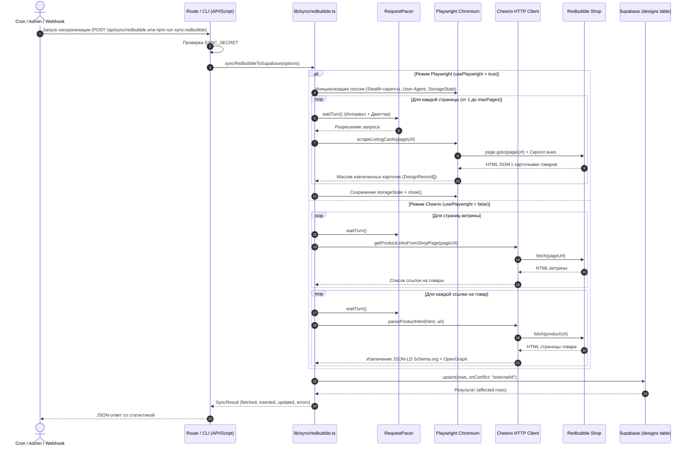

# Подсистема синхронизации с Redbubble

## 1. Введение и назначение

Подсистема синхронизации (`lib/sync/redbubble.ts`) предназначена для автоматического импорта и обновления каталога дизайнов из магазина автора на маркетплейсе **Redbubble**. 

Она решает задачи:
- Сбора актуального списка товаров магазина автора.
- Извлечения графических материалов высокого разрешения, заголовков, описаний, категорий и тегов.
- Сохранения и обновления (Upsert) карточек в базе данных без дублирования.
- Обхода защиты от ботов (Cloudflare Bot Management, Turnstile) и предотвращения блокировок по IP.

---

## 2. Архитектура и диаграмма последовательности

Синхронизация может инициироваться либо внешним планировщиком (Vercel Cron / HTTP Webhook), либо администратором вручную через терминал (CLI).



---

## 3. Двухрежимный сбор данных (Dual-Mode Scraping)

В зависимости от флага `SYNC_USE_PLAYWRIGHT` (или аргумента `usePlaywright: boolean`), конвейер синхронизации работает в одном из двух режимов:

### 3.1 Режим Playwright (Рекомендуемый для локального запуска / выделенных серверов)
Использует полноценный headless-браузер Chromium для рендеринга клиентского JavaScript на стороне Redbubble.

- **Скрытие признаков автоматизации (Stealth Evasions)**:
  При создании каждой новой страницы внедряется инъекционный скрипт:
  ```typescript
  await context.addInitScript(() => {
    Object.defineProperty(navigator, "webdriver", { get: () => false });
    window.chrome = window.chrome || { runtime: {} };
    Object.defineProperty(navigator, "plugins", { get: () => [1, 2, 3, 4, 5] });
    Object.defineProperty(navigator, "languages", { get: () => ["en-US", "en"] });
  });
  ```
- **Эмуляция скролла (Infinite Scroll & Lazy Loading)**:
  В функции `scrapeListingCards` выполняется серия из до 8 последовательных прокруток с проверкой `scrollHeight`:
  ```typescript
  for (let i = 0; i < 8; i += 1) {
    const previous = await page.evaluate(() => document.body.scrollHeight);
    await page.evaluate(() => window.scrollTo(0, document.body.scrollHeight));
    await page.waitForTimeout(1200);
    const current = await page.evaluate(() => document.body.scrollHeight);
    if (current === previous) break;
  }
  ```
- **Извлечение карточек прямо из листинга**:
  Парсятся узлы DOM `.xblock` и `[data-testid='search-result-card']`, что исключает необходимость отправлять отдельные HTTP-запросы к каждой странице товара. Это снижает количество запросов к Redbubble в 30–50 раз!
- **Персистентность сессии (`storageState`)**:
  При указании `SYNC_PLAYWRIGHT_STORAGE_STATE_PATH` куки и localStorage сохраняются в JSON-файл на диске (например, `.cache/redbubble-storage-state.json`). При последующих запусках браузер стартует с уже пройденными проверками безопасности.

### 3.2 Режим Cheerio (Легковесный HTTP-клиент для Serverless)
Не требует запуска браузера и бинарных файлов Chromium, что делает его совместимым с бессерверными средами (Vercel Serverless Functions).

- **Шаг 1: Сканирование страниц витрины**:
  Запрашивает HTML витрины `buildShopPageUrl(shopUrl, page)` и с помощью Cheerio ищет ссылки, содержащие `/i/` или `/shop/ap/`.
- **Шаг 2: Парсинг страниц товаров**:
  Для каждой найденной ссылки отправляется HTTP GET-запрос.
- **Шаг 3: Извлечение микроразметки JSON-LD**:
  На странице товара парсятся теги `<script type="application/ld+json">`. Скрипт ищет сущность со схемой `"@type": "Product"`:
  ```typescript
  const title = sanitizeText((jsonLd?.name as string) || ogTitle || $("h1").first().text());
  const description = sanitizeText((jsonLd?.description as string) || ogDescription || "");
  const image = sanitizeText((Array.isArray(jsonLd?.image) ? jsonLd?.image?.[0] : jsonLd?.image) as string);
  ```
- **Шаг 4: Fallback на OpenGraph и HTML**:
  Если микроразметка отсутствует или заблокирована, данные извлекаются из мета-тегов:
  `meta[property='og:title']`, `meta[property='og:image']`, `meta[property='og:description']`, `meta[name='keywords']`.

---

## 4. Механизмы защиты от блокировок и рейт-лимитинга

Redbubble активно использует сервисы защиты от парсинга (Cloudflare Bot Management). В коде реализован комплекс контрмер:

### 4.1 Пейсер запросов (`RequestPacer`)
Класс `RequestPacer` гарантирует соблюдение минимальной паузы между сетевыми обращениями и добавляет случайное отклонение (джиттер), симулируя естественное поведение человека:

```typescript
class RequestPacer {
  private lastRequestAt = 0;
  private readonly minIntervalMs: number;
  private readonly jitterMs: number;

  constructor(minIntervalMs: number, jitterMs: number) {
    this.minIntervalMs = Math.max(0, minIntervalMs);
    this.jitterMs = Math.max(0, jitterMs);
  }

  async waitTurn(): Promise<void> {
    const now = Date.now();
    const elapsed = now - this.lastRequestAt;
    const baseWait = Math.max(0, this.minIntervalMs - elapsed);
    const jitter = this.jitterMs > 0 ? Math.floor(Math.random() * this.jitterMs) : 0;
    const totalWait = baseWait + jitter;
    if (totalWait > 0) {
      await sleep(totalWait);
    }
    this.lastRequestAt = Date.now();
  }
}
```

По умолчанию:
- `SYNC_MIN_REQUEST_INTERVAL_MS=2500` (минимум 2.5 секунды между запросами).
- `SYNC_REQUEST_JITTER_MS=700` (дополнительная случайная задержка от 0 до 700 мс).
- `SYNC_PAGE_DELAY_MS=3000` (3 секунды паузы между страницами каталога).

### 4.2 Детекция проверок Cloudflare
Функция `isCloudflareChallengePage` анализирует тело ответа на маркеры блокировки:
```typescript
function isCloudflareChallengePage(html: string): boolean {
  return (
    /Just a moment/i.test(html) ||
    /Verifying you are human/i.test(html) ||
    /Verify you are human/i.test(html) ||
    /cf-browser-verification/i.test(html) ||
    /challenges\.cloudflare\.com/i.test(html)
  );
}
```
При обнаружении заглушки генератор выбрасывает подробное исключение с рекомендацией запустить Playwright в не-headless режиме (`SYNC_PLAYWRIGHT_HEADLESS=false`), один раз вручную решить капчу и переиспользовать сохраненный `storageState`.

---

## 5. Интерфейсы запуска

### 5.1 API Эндпоинт (`app/api/sync/redbubble/route.ts`)
Поддерживает методы `GET` и `POST`. Предназначен для вызова планировщиками (Vercel Cron, GitHub Actions, n8n, Cloudflare Workers).

#### Аутентификация
Запрос обязан содержать секретный токен, совпадающий со значением переменной `SYNC_SECRET`:
- Либо в заголовке запроса: `x-sync-secret: <YOUR_SECRET>`
- Либо в query-параметре: `?secret=<YOUR_SECRET>`

#### Пример запроса через cURL:
```bash
curl -X POST https://your-domain.com/api/sync/redbubble \
  -H "x-sync-secret: super-secret-token" \
  -H "Content-Type: application/json"
```

#### Формат успешного ответа:
```json
{
  "fetchedProductLinks": 48,
  "parsedProducts": 48,
  "inserted": 0,
  "updated": 48,
  "skipped": 0,
  "errors": 0,
  "errorMessages": []
}
```

### 5.2 Запуск через CLI (`scripts/sync-redbubble.ts`)
Удобен для локальной разработки, первичного наполнения базы и выполнения в выделенных контейнерах:

```bash
npm run sync:redbubble
```
Скрипт автоматически подгружает переменные из `.env` через `dotenv/config`, считывает настройки магазина из `getSiteConfig()` и выводит форматированный JSON-результат в консоль.

---

## 6. Логика Upsert и важный архитектурный нюанс

### 6.1 Логика Upsert в Supabase
Синхронизация обновляет записи в БД по уникальному ключу `externalId`:
```typescript
const { data, error } = await supabase
  .from("designs")
  .upsert(rows, { onConflict: "externalId" })
  .select("externalId");
```
Если дизайн с таким `externalId` уже существует, его поля `title`, `description`, `externalImageUrl`, `externalLink`, `keywords` и `updatedAt` актуализируются, а первичный ключ `id` (UUID) и дата создания `createdAt` остаются неизменными.

### 6.2 Архитектурный нюанс: целевая база данных для синхронизации
> **ВАЖНОЕ ЗАМЕЧАНИЕ ПО АРХИТЕКТУРЕ**:  
> В текущей версии кодовой базы функция синхронизации `syncRedbubbleToSupabase` (`lib/sync/redbubble.ts`) подключается **напрямую к Supabase через `@supabase/supabase-js`**, используя `NEXT_PUBLIC_SUPABASE_URL` и `SUPABASE_SERVICE_ROLE_KEY`.  
> Если в приложении включен `DATABASE_PROVIDER=mysql`, витрина и страницы сайта будут читать данные из MySQL, но процесс синхронизации по-прежнему запишет спарсенные данные в Supabase.

#### Рекомендация для полной поддержки MySQL:
Для унификации записи данных при использовании MySQL рекомендуется расширить `syncRedbubbleToSupabase` или добавить абстрактную функцию `upsertDesigns(designs)` в `utils/database.ts`, использующую конструкцию:
```sql
INSERT INTO designs (id, `externalId`, title, description, keywords, `imageName`, `externalImageUrl`, `externalLink`, category, collection, `updatedAt`)
VALUES (?, ?, ?, ?, ?, ?, ?, ?, ?, ?, NOW())
ON DUPLICATE KEY UPDATE
  title = VALUES(title),
  description = VALUES(description),
  keywords = VALUES(keywords),
  `externalImageUrl` = VALUES(`externalImageUrl`),
  `externalLink` = VALUES(`externalLink`),
  category = VALUES(category),
  collection = VALUES(collection),
  `updatedAt` = NOW();
```
