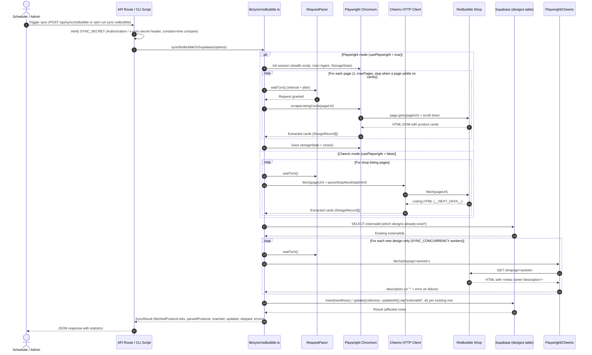

# Redbubble Synchronization Subsystem

## 1. Introduction and Purpose

The synchronization subsystem (`lib/sync/redbubble.ts`) automates importing and updating the design catalog from the author's shop on the **Redbubble** marketplace.

It solves the following tasks:

- Collecting the current list of the author's shop products.
- Extracting high-resolution artwork, titles, descriptions, categories, and tags.
- Collecting the author's Redbubble **collections** and each design's membership in them — Redbubble is the source of truth here, so the crawl overwrites the local `collections` / `design_collections` tables.
- Saving and updating (upsert) cards in the database without duplicates.
- Bypassing anti-bot protection (Cloudflare Bot Management, Turnstile) and avoiding IP blocks.

---

## 2. Architecture and Sequence Diagram

Synchronization can be triggered either by an external scheduler (HTTP call to the API route) or manually by an administrator from the terminal (CLI).



---

## 3. Dual-Mode Scraping

Depending on the `SYNC_USE_PLAYWRIGHT` flag (or the `usePlaywright: boolean` option), the pipeline runs in one of two modes.

### 3.1 Playwright mode (recommended for local runs / dedicated servers)

Uses a full headless Chromium browser to render Redbubble's client-side JavaScript.

- **Automation-detection hiding (stealth evasions)**:
  An injection script is installed when each new session is created:
  ```typescript
  await context.addInitScript(() => {
    Object.defineProperty(navigator, "webdriver", { get: () => false });
    window.chrome = window.chrome || { runtime: {} };
    Object.defineProperty(navigator, "plugins", { get: () => [1, 2, 3, 4, 5] });
    Object.defineProperty(navigator, "languages", { get: () => ["en-US", "en"] });
  });
  ```
- **Extracting cards from `__NEXT_DATA__`**:
  Redbubble's shop page embeds the full listing as JSON in `<script id="__NEXT_DATA__">` (`props.pageProps.results[].inventoryItem`). `parseShopNextData` (`lib/sync/redbubble.ts`) parses that JSON directly instead of scraping DOM cards, which removes the need to send a separate HTTP request to every product page and cuts the number of requests to Redbubble by roughly an order of magnitude. Both scraping modes (Playwright and Cheerio) use it identically for the listing pages — see §3.5 for the exact field mapping. Pagination stops once `page >= pagination.totalPages` or a page yields no designs. If `__NEXT_DATA__` is missing (layout change, or a challenge page that slipped past the Cloudflare check), `parseShopNextData` throws, the run records the error, and the listing crawl stops.
- **Session persistence (`storageState`)**:
  When `SYNC_PLAYWRIGHT_STORAGE_STATE_PATH` is set (`.env.example` ships `.cache/redbubble-storage-state.json`), cookies and localStorage are written to a JSON file on disk when the session closes, and the file is loaded again on the next run — so the browser starts with the security checks already passed. The `.cache` directory is created automatically if missing.

### 3.2 Cheerio mode (lightweight HTTP client for serverless)

Requires no browser or Chromium binaries, which makes it compatible with serverless environments (Vercel Serverless Functions). It requests the listing HTML with a plain `fetch(buildShopPageUrl(shopUrl, page))` and parses it with the same `parseShopNextData` used by Playwright mode — no per-product-page HTTP requests are made during the listing crawl. (Earlier versions fetched and parsed every individual product page here; that per-product enrichment was removed in favor of the listing-only extraction in §3.5 plus the per-work `/shop/ap/<workId>` fetch in §3.3, so both modes behave identically.) `buildShopPageUrl` always pins `sortOrder=recent` because the shop's default `top selling` sort overlaps between pages and silently drops designs from the crawl.

### 3.3 `/shop/ap/<workId>` fetch: description (new designs) and mockup color (new + backfill)

The shop listing's `__NEXT_DATA__` payload has neither the work description nor the artist's Classic T-Shirt mockup color, so both are read from a separate per-work fetch, after the existing-vs-new classification in §6.1. `GET https://www.redbubble.com/shop/ap/<workId>` (the "all products with this design" page, also used as the row's `externalLink`) is requested once per work id that needs it — every new design (description + mockup) and every existing design still missing `props.mockup_tshirt` (mockup only, §3.5) — through whichever fetch path the active mode uses (the Playwright session's `fetchHtml`, or the plain Cheerio `fetch`), paced by the same `RequestPacer`, with parallelism capped by `SYNC_CONCURRENCY` (default 1). The description is `<meta name="description" content="...">`'s value, trimmed but otherwise left as-is (it may contain literal `\n\n` paragraph breaks, matching how existing rows store it) and is only ever used for new designs. If the fetch fails, the design is still inserted/updated (with `description: ""` for a new design, and no `props` change for an existing one) and an error message is recorded — a fetch failure never drops a design from the sync.

### 3.4 Collections crawl

After the listing pages are scraped (in either mode), the artist's collections — read from `artistInfo.collections` on shop page 1 — are crawled to build design↔collection membership:

- For each collection, `?collections=<externalId>&page=N` is requested (via the same fetch path as the active mode: the Playwright session's `fetchHtml`, or the plain Cheerio `fetch`), paced by the same `RequestPacer`, for `N` from 1 up to `min(totalPages, maxPages)`; these pages also pin `sortOrder=recent` for the same paging-overlap reason as the main listing.
- Each filtered page is parsed with `parseShopNextData`; every design it contains is added to a **set** (not a list) of that collection's member ids — a design that shows up on more than one page of the same collection (paging overlap) is still only a member once. The final per-design `collections: string[]` is built from that set, in `artistInfo.collections` order — so a design that belongs to several collections gets `collections: ["Cats", "Dogs"]` in that order, and `collection` (the legacy single-value field) is set to the first title.
- `collectionsComplete` is `true` only if **every** collection was fully crawled: a fetch failure (network error, Cloudflare, missing `__NEXT_DATA__`) marks it `false` and is recorded in `errors`; a collection whose `totalPages` exceeds `maxPages` (so only a prefix of its pages was fetched) also marks it `false` and adds a `Collection "<title>" truncated at maxPages=N of totalPages=M` warning — a partial membership must never be written as if it were complete. Either way the run skips writing collections/links entirely instead of writing from incomplete data (see §6.2).
- Request cost example: an artist with 3 shop listing pages and 13 collections (each a single page) adds 13 requests to the 3 listing-page requests — no extra product-page requests, since collection pages reuse the same `__NEXT_DATA__` parsing as the shop listing.

### 3.5 Listing field mapping — matches the existing row format exactly

`parseShopNextData` maps every `results[].inventoryItem` into the same shape as every existing `designs` row:

- `externalId` = `Number(work.id)`; `title` = `work.title`; `keywords` = `work.tags.join(", ")`.
- `externalLink` = `https://www.redbubble.com/shop/ap/<workId>` (the "all products with this design" page, also used by the site's buy button) — **not** the specific product-type page URL.
- `externalImageUrl` = the flat, full-artwork image built from any preview URL for the same work: `https://<host>/image.<A>.<B>/<variant>` → `https://<host>/image.<A>.<B>/flat,500x,075,f.u2.jpg` (`buildArtworkImageUrl`), preferring the `product_close` preview and falling back to the first one.
- `category` = `"no_category"`, `collection` = `"no_collection"` (overwritten later by the collections crawl, §3.4), `imageName` = `null`, `backgroundColor` = `"#FFFFFF"`, `backgroundColors` = `""`, `shared` = `false`, `description` = `""` (filled in for new designs only, §3.3).
- `props` is always `null` at listing time — the mockup color is never known from `__NEXT_DATA__`. It's set to `{ mockup_tshirt: <url> }` only once a `/shop/ap/<workId>` page has been fetched (§3.3) and `extractClassicTeeMockupUrl(html, workId)` finds a match: the artist's own Classic T-Shirt color for that work, read from the page's Apollo state (slashes there are encoded as `{{%2F}}` and must be decoded first). Because the state also embeds Classic T-Shirt previews for *related* works, the match is scoped to this work's own preview by its image id suffix, which always equals the last 4 digits of the work id (`https://<host>/image.<A>.<last4>/ssrco,classic_tee,<variant>,<colorToken>,...`); the mockup URL is then rebuilt as `https://<host>/image.<A>.<last4>/ssrco,classic_tee,flatlay,<colorToken>,front,tall_portrait,x1000.jpg`. If no match is found, `props` stays `null` (new design) or is left unchanged (existing design), and a `No Classic T-Shirt preview for <id>; mockup_tshirt not set` warning is recorded. For a row that already exists in the database, this same `/shop/ap/<workId>` fetch is made — once — whenever `mockup_tshirt` is missing from the row's existing `props`; any other keys already present in `props` are preserved, and an existing `mockup_tshirt` is never overwritten (no fetch happens for rows that already have it). This backfill runs independently of `collectionsComplete` (§6.2): even when the collections crawl is incomplete and `collection` is left untouched, a missing `mockup_tshirt` is still added via a `props`-only update. Request cost: one `/shop/ap/<workId>` request per new design and one per existing design still missing `mockup_tshirt` (shared with the description fetch in §3.3 for new designs — no extra request beyond it).

Dedupes by `externalId` (first occurrence wins), and skips any entry missing an id, title, product page, or preview image.

### 3.6 Shop URL normalization and SSRF protection

Before any request is made, `normalizeShopUrl()` (`lib/sync/redbubble.ts`) validates the shop URL:

- Only `https://` URLs on `www.redbubble.com` / `redbubble.com` are accepted (a bare username like `your-shop` is expanded to `https://www.redbubble.com/people/your-shop/shop`).
- An `/explore` path segment is rewritten to `/shop`, and trailing slashes are stripped.
- Anything else (other protocols, other hosts, malformed input) is rejected, and the run fails with `Missing Redbubble shop URL`.

---

## 4. Anti-Blocking and Rate-Limiting Mechanisms

Redbubble actively uses anti-scraping services (Cloudflare Bot Management). The code implements a set of countermeasures.

### 4.1 Request pacer (`RequestPacer`)

The `RequestPacer` class guarantees a minimum pause between network calls and adds random jitter to mimic natural human behavior. Calls are serialized through an internal promise queue, so concurrent workers (Cheerio mode) cannot race past the interval:

```typescript
export class RequestPacer {
  private lastRequestAt = 0;
  private queue: Promise<void> = Promise.resolve();

  constructor(
    private readonly minIntervalMs: number,
    private readonly jitterMs: number,
  ) {
    this.minIntervalMs = Math.max(0, minIntervalMs);
    this.jitterMs = Math.max(0, jitterMs);
  }

  async waitTurn(): Promise<void> {
    this.queue = this.queue.then(async () => {
      const now = Date.now();
      const elapsed = now - this.lastRequestAt;
      const baseWait = Math.max(0, this.minIntervalMs - elapsed);
      const jitter = this.jitterMs > 0 ? Math.floor(Math.random() * this.jitterMs) : 0;
      const totalWait = baseWait + jitter;
      if (totalWait > 0) {
        await sleep(totalWait);
      }
      this.lastRequestAt = Date.now();
    });
    return this.queue;
  }
}
```

Defaults (overridable via environment variables):

- `SYNC_MIN_REQUEST_INTERVAL_MS=2500` — at least 2.5 seconds between requests.
- `SYNC_REQUEST_JITTER_MS=700` — extra random delay from 0 to 700 ms.
- `SYNC_PAGE_DELAY_MS=3000` — 3-second pause between catalog pages.

### 4.2 Cloudflare challenge detection

`isCloudflareChallengePage` analyzes the response body for block markers:
```typescript
function isCloudflareChallengePage(html: string): boolean {
  return (
    /Just a moment/i.test(html) ||
    /Verifying you are human/i.test(html) ||
    /Verify you are human/i.test(html) ||
    /cf-browser-verification/i.test(html) ||
    /challenges\.cloudflare\.com/i.test(html)
  );
}
```

When a challenge page is detected, a descriptive error is thrown whose advice depends on the mode:

- **Cheerio mode**: *"Set REDBUBBLE_COOKIE and REDBUBBLE_USER_AGENT from a real browser session."*
- **Playwright mode**: *"Run once with SYNC_PLAYWRIGHT_HEADLESS=false and complete challenge, then reuse SYNC_PLAYWRIGHT_STORAGE_STATE_PATH."*

---

## 5. Invocation Interfaces

### 5.1 API endpoint (`app/api/sync/redbubble/route.ts`)

Exports a single `POST` handler, intended to be called by schedulers (n8n, GitHub Actions, Cloudflare Workers, system crontab). Guards applied before any scraping:

| Condition | Response |
|---|---|
| Another sync is still running | `409` — `Sync operation is already in progress. Please retry later.` |
| `SYNC_SECRET` not configured | `500` — `SYNC_SECRET is not configured` |
| Missing/incorrect secret | `401` — `Unauthorized` |
| `DATABASE_PROVIDER=mysql` | `400` — sync supports the Supabase provider only (see 6.2) |
| No shop URL resolvable | `400` — `Missing Redbubble shop URL` |
| Supabase env vars missing | `500` — `Missing Supabase environment variables` |

#### Authentication

The request must carry a secret token matching `SYNC_SECRET`:

- either in the `Authorization` header: `Authorization: Bearer <YOUR_SECRET>`
- or in the `x-sync-secret` header: `x-sync-secret: <YOUR_SECRET>`

The comparison uses `crypto.timingSafeEqual` (constant time) to prevent timing attacks. There is **no query-parameter authentication** — `?secret=...` is not accepted.

#### cURL example

```bash
curl -X POST https://your-domain.com/api/sync/redbubble \
  -H "x-sync-secret: super-secret-token" \
  -H "Content-Type: application/json"
```

#### Successful response shape

```json
{
  "fetchedProductLinks": 48,
  "parsedProducts": 48,
  "inserted": 6,
  "updated": 42,
  "skipped": 0,
  "errors": 0,
  "errorMessages": [],
  "dryRun": false,
  "warnings": [],
  "collections": { "found": 13, "upserted": 13, "links": 51 }
}
```

Note on counters: `inserted` and `updated` reflect the actual rows written by the insert/update passes described in §6.1. `skipped` counts rows dropped due to a title collision (either within the scraped batch or against a different `externalId` already in the DB). An existing row left untouched because `collectionsComplete` was `false` (§6.1) is neither `updated` nor `skipped` — it's only reflected in a `warnings` entry (`"<n> existing row(s) left unchanged: collections crawl incomplete"`). `warnings` also lists the human-readable reason for each skip. Pass `dryRun: true` to preview `inserted`/`updated`/`plan` without writing.

#### Shop URL resolution order

Both the API route and the CLI resolve the target shop as:

```typescript
const shopUrl =
  config.representation?.redbubbleShopUrl ||
  config.representation?.redbuble ||   // legacy key kept for backward compatibility
  process.env.REDBUBBLE_SHOP_URL ||
  "";
```

i.e. the `studio` table value wins over the `REDBUBBLE_SHOP_URL` environment variable.

### 5.2 CLI invocation (`scripts/sync-redbubble.ts`)

Convenient for local development, initial catalog population, and dedicated containers:

```bash
npm run sync:redbubble
```

The script loads variables from `.env` via `dotenv/config`, reads the shop settings via `loadSiteConfig()` (falling back to `REDBUBBLE_SHOP_URL` if config isn't reachable), runs the sync, prints the formatted JSON result to the console, and closes the MySQL pool (if any) via `closeDatabaseConnections()` before exiting. It sets a non-zero exit code on failure, including when the result reports `errors > 0`.

Because RLS only grants anon `SELECT`, real writes require `SUPABASE_SERVICE_ROLE_KEY` — the script throws if it is missing. Pass `--dry-run` (or `npm run sync:redbubble:dry`) to preview the insert/update plan without writing; in dry-run mode the anon key is accepted since no write occurs.

#### Output target (`--target`)

`--target=db|json|both` (default `db`, or env `SYNC_TARGET`) controls where the scrape ends up:

- `db` (default): scrapes and writes to Supabase only, same as before — `syncRedbubbleToSupabase` under the hood.
- `json`: scrapes only (`fetchRedbubbleDesigns`) and writes the result to a JSON file. **Never creates a Supabase client** and never calls `loadSiteConfig()` unless `REDBUBBLE_SHOP_URL` is unset (in which case it tries config and fails with a clear error if that also comes up empty). Because the new-vs-existing classification that gates the `/shop/ap/<workId>` fetch (§3.3) lives in the DB write path, this target never makes that fetch at all — every design's `description` stays `""` and `props` stays `null` (no mockup color). Convenient for inspecting a scrape, or for feeding another process, without any DB credentials.
- `both`: scrapes once, writes to Supabase, and also writes the JSON file (reusing the single scrape — it never scrapes twice).

`--out=<path>` (default `.cache/redbubble-sync.json`, or env `SYNC_OUT`) sets the JSON file's location; the parent directory is created if missing. `.cache/` is gitignored.

JSON file shape:

```json
{
  "meta": { "shopUrl": "...", "fetchedAt": "2026-09-24T12:00:00.000Z", "mode": "playwright", "target": "json" },
  "collections": [
    { "externalId": 4167183, "title": "States of the USA", "description": null, "coverImageUrl": "...", "workIds": [173146884] }
  ],
  "designs": [ /* DesignRecord[], each with a `collections: string[]` title list */ ],
  "result": { /* SyncResult — only present for --target=both */ },
  "errors": []
}
```

Run `npm run sync:redbubble:json` for the `json` target directly.

---

## 6. Upsert Logic and an Important Architectural Caveat

### 6.1 Insert/update logic in Supabase

The `designs` table has two unique constraints — `externalId` and `title` (see `init/postgres_tables.sql`) — so a naive single-batch upsert can fail the whole run on one title collision. More importantly, **an existing row's curated content must never be touched by the sync** — only Redbubble-sourced fields may change, and only `collection` is one of them. The pipeline:

1. Deduplicates the scraped batch by `externalId`, then by `title` — if two different `externalId`s scraped in the same run share a title, only the first is kept; the rest are skipped with a warning.
2. Reads which of the batch's `externalId`s already exist in Supabase, in chunks of 100 (`.select("externalId, props").in("externalId", ids)` — `props` is read only to know whether `props.mockup_tshirt` needs backfilling, §3.5; no other curated column is ever read back), and separately checks `title` collisions against the DB in chunks of 25, via `.filter("title", "in", "(\"a\",\"b\")")` with each value double-quoted and internal `"`/`\` escaped (`.in()` quotes but does not escape embedded quotes, which breaks on titles like `24", 36" Print`).

   If a chunk's read fails, that chunk's rows are added to `errors`, excluded from any write, and the next chunk is still processed.
3. Classifies each remaining row:
   - **skip** — its title is already used by a different `externalId` in the database;
   - **update** — a row for its `externalId` already exists. If the collections crawl succeeded this run (`collectionsComplete`, §3.4 — Redbubble is the source of truth for collection membership), the row is queued for a `collection` update; **no other field is ever changed** except a `props.mockup_tshirt` backfill (§3.5) — `title`, `description`, `keywords`, `category`, `externalLink`, `externalImageUrl`, `imageName`, `backgroundColor`, `backgroundColors`, `shared`, and the rest of `props` are left exactly as they are in the database, even if the scrape produced a different value. If `collectionsComplete` is `false`, `collection` is left untouched, but a missing `props.mockup_tshirt` is still backfilled via a `props`-only update; if neither `collection` nor `props` changes, the row isn't touched at all — it's counted as unchanged, not updated;
   - **insert** — no existing row for its `externalId`: written as-is from the listing scrape (§3.5) plus the description fetched in §3.3, with the `collections` title list stripped (the `designs` table has no such column).
4. Descriptions (§3.3) are fetched only for rows classified as **insert** in step 3, never for **update** rows.
5. In `dryRun` mode, no writes happen — the response includes `plan: { insert, update, collections, links }`, where `insert` holds the full rows that would be written and `update` holds `{ externalId, collection?, props? }` per row, including `props` only when a `mockup_tshirt` backfill would happen (see §6.2).
6. Otherwise: inserts are written in chunked calls of 100 (`.insert(chunk).select("id")`); updates are written **one row at a time** as `.update({ collection?, props?, updatedAt }).eq("externalId", externalId)` (only the changed fields are included) — deliberately not a batch upsert, because an `upsert(rows, { onConflict: "externalId" })` with only these columns would violate the other columns' `NOT NULL` constraints on the insert branch Postgres builds internally for `ON CONFLICT DO UPDATE`, even though that branch is never actually taken. A failed insert chunk or a failed single-row update adds to `errors` and pushes the Supabase error message to `errorMessages`; the rest of the batch is still processed.

### 6.2 Collections and `design_collections` write

Only runs when the collections crawl fully succeeded (`collectionsComplete`, §3.4); otherwise a warning is added and this step is skipped entirely (existing `collections`/`design_collections` rows are left untouched — collections removed from a Redbubble collection just lose their links, the `collections` row itself is never deleted).

1. Upserts `collections` by `externalId` (chunks of 100, `.select("id, externalId")` to get back each row's uuid).
2. Resolves the uuid `id` of every design that was successfully inserted or updated in this run (chunks of 100, `.select("id, externalId").in("externalId", ids)` — a design whose insert/update chunk failed is excluded, so its links are never touched).
3. For each chunk of 100 resolved designs, **link writes are upsert-before-delete** so a failed write can never leave a design with zero links:
   - Builds the chunk's fresh `{ designId, collectionId }` rows from each design's `collections` title list and writes them with `.upsert(rows, { onConflict: "designId,collectionId", ignoreDuplicates: true }).select()`. A duplicate pair within the same design (e.g. paging overlap) can't occur — membership is deduped per design before this point (§3.4) — but `ignoreDuplicates` is also a safety net against a row that already exists from a previous run.
   - If that upsert fails, the chunk's errors are counted, `errorMessages` gets the Supabase message, and **no delete is issued for that chunk** — existing links are left exactly as they were, and the next chunk is still processed.
   - If it succeeds, stale links are removed for that chunk only: for each collection known this run, one `.delete().eq("collectionId", cid).in("designId", nonMemberIds)` scoped to the chunk's designs that are no longer members of it (skipped when there are none — keeps the request count to roughly `chunks × collections`, e.g. 3 chunks × 13 collections for ~300 designs); then one more `.delete().in("designId", chunkDesignIds).not("collectionId", "in", currentCollectionUuids)` to drop links to any collection that isn't part of this run's fetched set at all.
4. Any failure at any of these steps is pushed to `errorMessages`, counted in `errors`, and does not abort the rest of the sync.

`SyncResult.collections = { found, upserted, links }` reports the number of collections scraped, the number of collection rows upserted, and the number of `design_collections` rows successfully upserted (0/0 when `dryRun`, when `collectionsComplete` is `false`, or for a chunk whose link upsert failed).

### 6.3 Architectural caveat: target database of the sync

> **IMPORTANT ARCHITECTURAL NOTE**:
> The sync core `syncRedbubbleToSupabase` (`lib/sync/redbubble.ts`) connects **directly to Supabase via `@supabase/supabase-js`**, using `NEXT_PUBLIC_SUPABASE_URL` and `SUPABASE_SERVICE_ROLE_KEY` (falling back to `NEXT_PUBLIC_SUPABASE_ANON_KEY`). It never writes to MySQL. The two entry points differ in how they handle `DATABASE_PROVIDER=mysql`:
>
> - **API route** (`app/api/sync/redbubble/route.ts`): rejects the call upfront with HTTP `400` — *"Redbubble sync currently supports Supabase provider only. Please configure DATABASE_PROVIDER=supabase."*
> - **CLI script** (`scripts/sync-redbubble.ts`): has no such guard. It reads site config (including the shop URL) from whichever provider `DATABASE_PROVIDER` selects — so with `mysql` the `studio` table is read from MySQL — but the scraped designs are still written to Supabase.

#### Recommendation for full MySQL support

To unify writes when using MySQL, extend `syncRedbubbleToSupabase` or add an abstract `upsertDesigns(designs)` function in `utils/database.ts` using:

```sql
INSERT INTO designs (id, `externalId`, title, description, keywords, `imageName`, `externalImageUrl`, `externalLink`, category, collection, `updatedAt`)
VALUES (?, ?, ?, ?, ?, ?, ?, ?, ?, ?, NOW())
ON DUPLICATE KEY UPDATE
  title = VALUES(title),
  description = VALUES(description),
  keywords = VALUES(keywords),
  `externalImageUrl` = VALUES(`externalImageUrl`),
  `externalLink` = VALUES(`externalLink`),
  category = VALUES(category),
  collection = VALUES(collection),
  `updatedAt` = NOW();
```
