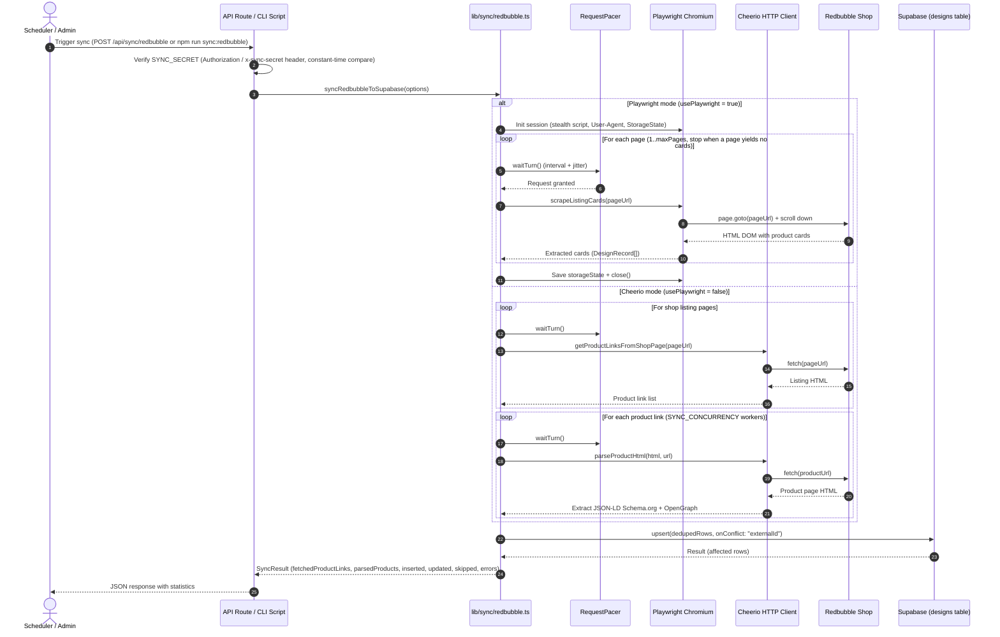

# Redbubble Synchronization Subsystem

## 1. Introduction and Purpose

The synchronization subsystem (`lib/sync/redbubble.ts`) automates importing and updating the design catalog from the author's shop on the **Redbubble** marketplace.

It solves the following tasks:

- Collecting the current list of the author's shop products.
- Extracting high-resolution artwork, titles, descriptions, categories, and tags.
- Saving and updating (upsert) cards in the database without duplicates.
- Bypassing anti-bot protection (Cloudflare Bot Management, Turnstile) and avoiding IP blocks.

---

## 2. Architecture and Sequence Diagram

Synchronization can be triggered either by an external scheduler (HTTP call to the API route) or manually by an administrator from the terminal (CLI).



---

## 3. Dual-Mode Scraping

Depending on the `SYNC_USE_PLAYWRIGHT` flag (or the `usePlaywright: boolean` option), the pipeline runs in one of two modes.

### 3.1 Playwright mode (recommended for local runs / dedicated servers)

Uses a full headless Chromium browser to render Redbubble's client-side JavaScript.

- **Automation-detection hiding (stealth evasions)**:
  An injection script is installed when each new session is created:
  ```typescript
  await context.addInitScript(() => {
    Object.defineProperty(navigator, "webdriver", { get: () => false });
    window.chrome = window.chrome || { runtime: {} };
    Object.defineProperty(navigator, "plugins", { get: () => [1, 2, 3, 4, 5] });
    Object.defineProperty(navigator, "languages", { get: () => ["en-US", "en"] });
  });
  ```
- **Scroll emulation (infinite scroll & lazy loading)**:
  `scrapeListingCards` performs up to 8 consecutive scrolls, checking `scrollHeight`:
  ```typescript
  for (let i = 0; i < 8; i += 1) {
    const previous = await page.evaluate(() => document.body.scrollHeight);
    await page.evaluate(() => window.scrollTo(0, document.body.scrollHeight));
    await page.waitForTimeout(1200);
    const current = await page.evaluate(() => document.body.scrollHeight);
    if (current === previous) break;
  }
  ```
- **Extracting cards directly from the listing**:
  DOM nodes matching `.xblock` and `[data-testid='search-result-card']` are parsed, which removes the need to send a separate HTTP request to every product page and cuts the number of requests to Redbubble by roughly an order of magnitude. The trade-off: cards scraped from the listing carry only `externalId`, `title`, `externalLink`, and `externalImageUrl`; `description` and `keywords` are stored as empty strings and `collection` is set to `no_collection`. Full metadata is only available in Cheerio mode (3.2). Pagination stops as soon as a page yields no cards.
- **Session persistence (`storageState`)**:
  When `SYNC_PLAYWRIGHT_STORAGE_STATE_PATH` is set (`.env.example` ships `.cache/redbubble-storage-state.json`), cookies and localStorage are written to a JSON file on disk when the session closes, and the file is loaded again on the next run — so the browser starts with the security checks already passed. The `.cache` directory is created automatically if missing.

### 3.2 Cheerio mode (lightweight HTTP client for serverless)

Requires no browser or Chromium binaries, which makes it compatible with serverless environments (Vercel Serverless Functions).

- **Step 1: Scan shop listing pages**:
  Requests the listing HTML `buildShopPageUrl(shopUrl, page)` and uses Cheerio to collect links containing `/i/` or `/shop/ap/`.
- **Step 2: Parse product pages**:
  An HTTP GET request is issued for every discovered link, with concurrency capped by `SYNC_CONCURRENCY` (default 1).
- **Step 3: Extract JSON-LD microdata**:
  On the product page, `<script type="application/ld+json">` tags are parsed, looking for the entity with `"@type": "Product"`:
  ```typescript
  const title = sanitizeText((jsonLd?.name as string) || ogTitle || $("h1").first().text());
  const description = sanitizeText((jsonLd?.description as string) || ogDescription || "");
  const image = sanitizeText((Array.isArray(jsonLd?.image) ? jsonLd?.image?.[0] : jsonLd?.image) as string);
  ```
- **Step 4: OpenGraph and HTML fallback**:
  If microdata is missing or blocked, data is extracted from meta tags:
  `meta[property='og:title']`, `meta[property='og:image']`, `meta[property='og:description']`, `meta[name='keywords']`.

### 3.3 Shop URL normalization and SSRF protection

Before any request is made, `normalizeShopUrl()` (`lib/sync/redbubble.ts`) validates the shop URL:

- Only `https://` URLs on `www.redbubble.com` / `redbubble.com` are accepted (a bare username like `your-shop` is expanded to `https://www.redbubble.com/people/your-shop/shop`).
- An `/explore` path segment is rewritten to `/shop`, and trailing slashes are stripped.
- Anything else (other protocols, other hosts, malformed input) is rejected, and the run fails with `Missing Redbubble shop URL`.

---

## 4. Anti-Blocking and Rate-Limiting Mechanisms

Redbubble actively uses anti-scraping services (Cloudflare Bot Management). The code implements a set of countermeasures.

### 4.1 Request pacer (`RequestPacer`)

The `RequestPacer` class guarantees a minimum pause between network calls and adds random jitter to mimic natural human behavior. Calls are serialized through an internal promise queue, so concurrent workers (Cheerio mode) cannot race past the interval:

```typescript
export class RequestPacer {
  private lastRequestAt = 0;
  private queue: Promise<void> = Promise.resolve();

  constructor(
    private readonly minIntervalMs: number,
    private readonly jitterMs: number,
  ) {
    this.minIntervalMs = Math.max(0, minIntervalMs);
    this.jitterMs = Math.max(0, jitterMs);
  }

  async waitTurn(): Promise<void> {
    this.queue = this.queue.then(async () => {
      const now = Date.now();
      const elapsed = now - this.lastRequestAt;
      const baseWait = Math.max(0, this.minIntervalMs - elapsed);
      const jitter = this.jitterMs > 0 ? Math.floor(Math.random() * this.jitterMs) : 0;
      const totalWait = baseWait + jitter;
      if (totalWait > 0) {
        await sleep(totalWait);
      }
      this.lastRequestAt = Date.now();
    });
    return this.queue;
  }
}
```

Defaults (overridable via environment variables):

- `SYNC_MIN_REQUEST_INTERVAL_MS=2500` — at least 2.5 seconds between requests.
- `SYNC_REQUEST_JITTER_MS=700` — extra random delay from 0 to 700 ms.
- `SYNC_PAGE_DELAY_MS=3000` — 3-second pause between catalog pages.

### 4.2 Cloudflare challenge detection

`isCloudflareChallengePage` analyzes the response body for block markers:
```typescript
function isCloudflareChallengePage(html: string): boolean {
  return (
    /Just a moment/i.test(html) ||
    /Verifying you are human/i.test(html) ||
    /Verify you are human/i.test(html) ||
    /cf-browser-verification/i.test(html) ||
    /challenges\.cloudflare\.com/i.test(html)
  );
}
```

When a challenge page is detected, a descriptive error is thrown whose advice depends on the mode:

- **Cheerio mode**: *"Set REDBUBBLE_COOKIE and REDBUBBLE_USER_AGENT from a real browser session."*
- **Playwright mode**: *"Run once with SYNC_PLAYWRIGHT_HEADLESS=false and complete challenge, then reuse SYNC_PLAYWRIGHT_STORAGE_STATE_PATH."*

---

## 5. Invocation Interfaces

### 5.1 API endpoint (`app/api/sync/redbubble/route.ts`)

Exports a single `POST` handler, intended to be called by schedulers (n8n, GitHub Actions, Cloudflare Workers, system crontab). Guards applied before any scraping:

| Condition | Response |
|---|---|
| Another sync is still running | `409` — `Sync operation is already in progress. Please retry later.` |
| `SYNC_SECRET` not configured | `500` — `SYNC_SECRET is not configured` |
| Missing/incorrect secret | `401` — `Unauthorized` |
| `DATABASE_PROVIDER=mysql` | `400` — sync supports the Supabase provider only (see 6.2) |
| No shop URL resolvable | `400` — `Missing Redbubble shop URL` |
| Supabase env vars missing | `500` — `Missing Supabase environment variables` |

#### Authentication

The request must carry a secret token matching `SYNC_SECRET`:

- either in the `Authorization` header: `Authorization: Bearer <YOUR_SECRET>`
- or in the `x-sync-secret` header: `x-sync-secret: <YOUR_SECRET>`

The comparison uses `crypto.timingSafeEqual` (constant time) to prevent timing attacks. There is **no query-parameter authentication** — `?secret=...` is not accepted.

#### cURL example

```bash
curl -X POST https://your-domain.com/api/sync/redbubble \
  -H "x-sync-secret: super-secret-token" \
  -H "Content-Type: application/json"
```

#### Successful response shape

```json
{
  "fetchedProductLinks": 48,
  "parsedProducts": 48,
  "inserted": 0,
  "updated": 48,
  "skipped": 0,
  "errors": 0,
  "errorMessages": []
}
```

Note on counters: because the pipeline writes with a single upsert call, `inserted` always reports `0` and all upserted rows are counted in `updated`; `skipped` reports `0` on the upsert path, or the fetched product-link count when no rows parse (e.g., a fully Cloudflare-blocked run reports every link as skipped).

#### Shop URL resolution order

Both the API route and the CLI resolve the target shop as:

```typescript
const shopUrl =
  config.representation?.redbubbleShopUrl ||
  config.representation?.redbuble ||   // legacy key kept for backward compatibility
  process.env.REDBUBBLE_SHOP_URL ||
  "";
```

i.e. the `studio` table value wins over the `REDBUBBLE_SHOP_URL` environment variable.

### 5.2 CLI invocation (`scripts/sync-redbubble.ts`)

Convenient for local development, initial catalog population, and dedicated containers:

```bash
npm run sync:redbubble
```

The script loads variables from `.env` via `dotenv/config`, reads the shop settings via `getSiteConfig()`, runs the same `syncRedbubbleToSupabase()` core, prints the formatted JSON result to the console, and closes the MySQL pool (if any) via `closeDatabaseConnections()` before exiting. It sets a non-zero exit code on failure.

---

## 6. Upsert Logic and an Important Architectural Caveat

### 6.1 Upsert logic in Supabase

Synchronization writes records keyed by the unique `externalId`. The batch is first deduplicated by `externalId` in memory, then upserted in one call:

```typescript
const { data, error } = await supabase
  .from("designs")
  .upsert(dedupedRows, { onConflict: "externalId", ignoreDuplicates: false })
  .select("id, externalId");
```

If a design with the given `externalId` already exists, its `title`, `description`, `keywords`, `externalLink`, `externalImageUrl`, `category`, `collection`, `imageName`, `backgroundColor`/`backgroundColors`, `shared`, `props`, and `updatedAt` columns are refreshed, while the primary key `id` (UUID) and creation date `createdAt` stay untouched. On an upsert error, all rows of the batch are added to the `errors` counter and the Supabase error message is appended to `errorMessages`.

### 6.2 Architectural caveat: target database of the sync

> **IMPORTANT ARCHITECTURAL NOTE**:
> The sync core `syncRedbubbleToSupabase` (`lib/sync/redbubble.ts`) connects **directly to Supabase via `@supabase/supabase-js`**, using `NEXT_PUBLIC_SUPABASE_URL` and `SUPABASE_SERVICE_ROLE_KEY` (falling back to `NEXT_PUBLIC_SUPABASE_ANON_KEY`). It never writes to MySQL. The two entry points differ in how they handle `DATABASE_PROVIDER=mysql`:
>
> - **API route** (`app/api/sync/redbubble/route.ts`): rejects the call upfront with HTTP `400` — *"Redbubble sync currently supports Supabase provider only. Please configure DATABASE_PROVIDER=supabase."*
> - **CLI script** (`scripts/sync-redbubble.ts`): has no such guard. It reads site config (including the shop URL) from whichever provider `DATABASE_PROVIDER` selects — so with `mysql` the `studio` table is read from MySQL — but the scraped designs are still written to Supabase.

#### Recommendation for full MySQL support

To unify writes when using MySQL, extend `syncRedbubbleToSupabase` or add an abstract `upsertDesigns(designs)` function in `utils/database.ts` using:

```sql
INSERT INTO designs (id, `externalId`, title, description, keywords, `imageName`, `externalImageUrl`, `externalLink`, category, collection, `updatedAt`)
VALUES (?, ?, ?, ?, ?, ?, ?, ?, ?, ?, NOW())
ON DUPLICATE KEY UPDATE
  title = VALUES(title),
  description = VALUES(description),
  keywords = VALUES(keywords),
  `externalImageUrl` = VALUES(`externalImageUrl`),
  `externalLink` = VALUES(`externalLink`),
  category = VALUES(category),
  collection = VALUES(collection),
  `updatedAt` = NOW();
```
